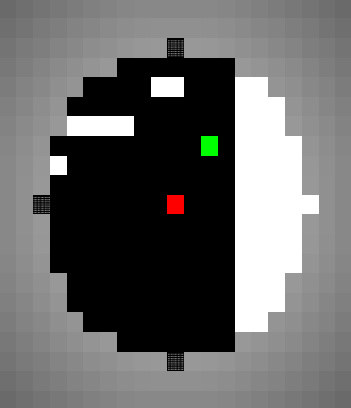

# zamlbie

## Overview
Zamlbie is a networked multiplayer TUI (Text-based User Interface) zombie infection game written in OCaml. Players can either fight to survive as humans or infect others as zombies in a multi-level themed game environment. The game leverages ATD for type definitions and Dream for both RESTful API and WebSocket connections, featuring dedicated server/client architecture.



## Features
- **Multiplayer Gameplay**: Join existing games or create custom ones
- **Dual Roles**: Play as humans trying to survive or zombies attempting to infect
- **Multi-level Environment**: Navigate through multiple floors with various obstacles and strategies
- **Customizable Settings**: Configure game parameters like map size, view distances, and time limits
- **Scalable Architecture**: Designed to host hundreds of players simultaneously
- **Terminal-based Interface**: Clean, efficient TUI designed for accessibility and performance

## Technical Stack
- **Language**: OCaml
- **API**: (REST + WebSockets)
- **Type Definitions**: ATD
- **Architecture**: Client-Server model

## Installation
1. Ensure OCaml and OPAM are installed on your system:
   ```bash
   # On Debian/Ubuntu
   apt-get install opam
   # On macOS
   brew install opam
   
   # Initialize OPAM and install OCaml
   opam init
   opam switch create 5.2.0  # Project requires OCaml 5.2.0 or higher
   eval $(opam env)
   ```

2. Clone the repository:
   ```bash
   git clone https://github.com/yoangau/zamlbie.git
   cd zamlbie
   ```

3. Install dependencies:
   ```bash
   opam install . --deps-only
   ```

## Usage

### Running the server
```bash
dune exec server
```

### Running the client
```bash
# Join an existing game
dune exec client -- --join <game_id>

# Create a new game with custom parameters
dune exec client -- --create --width 30 --height 30 --human-view-radius 6

# For testing purposes, you can run multiple clients in separate terminals
dune exec server
./_build/default/bin/main_client.exe --create --tick-delta 0.01 --max-player-count 2
./_build/default/bin/main_client.exe --join <game_id>

# For testing in test mode
dune exec client -- --test
```

### Game Controls
- Use arrow keys to move your character
- Press ESC to exit the game at any time

### Game Customization
You can customize various aspects of the game when creating a new session:

| Parameter                | Description                          | Default |
| ------------------------ | ------------------------------------ | ------- |
| `--width`                | Width of the game map                | 20      |
| `--height`               | Height of the game map               | 20      |
| `--human-view-radius`    | Vision radius for human players      | 5       |
| `--zombie-view-radius`   | Vision radius for zombie players     | 5       |
| `--max-player-count`     | Maximum number of players            | 2       |
| `--time-limit`           | Game time limit in seconds           | 60      |
| `--tick-delta`           | Time between game updates in seconds | 0.5     |
| `--walls-per-floor`      | Number of walls on each floor        | 10      |
| `--staircases-per-floor` | Number of staircases between floors  | 2       |
| `--number-of-floor`      | Total number of floors in the game   | 3       |

## Game Rules
1. Humans must survive until the time limit expires
2. Zombies must infect all humans before time runs out
3. Players navigate through multiple floors using staircases
4. Limited vision requires strategic movement and cooperation

## Contributing
Contributions are welcome! Follow these steps to contribute:
1. Fork the repository
2. Create a new branch for your feature or bug fix
3. Submit a pull request with clear descriptions

## Authors
- Yoan Gauthier
- David Garnier

## License
This project is licensed under the MIT License. See the [LICENSE](LICENSE) file for details.
