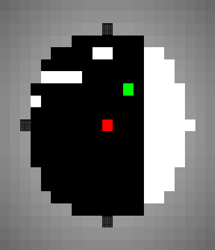

# zamlbie

## Overview
Zamlbie is a networked multiplayer TUI (Text-based User Interface) zombie infection game written in OCaml. Players can either fight to survive as humans or infect others as zombies in a multi-level themed game environment. The game leverages ATD for type definitions and an OCaml 5 multicore stack — Eio for structured concurrency, httpun for the RESTful API and httpun-ws for WebSocket connections — featuring dedicated server/client architecture.



## Features
- **Multiplayer Gameplay**: Join existing games or create custom ones
- **Dual Roles**: Play as humans trying to survive or zombies attempting to infect
- **Multi-level Environment**: Navigate through multiple floors with various obstacles and strategies
- **Customizable Settings**: Configure game parameters like map size, view distances, and time limits
- **Scalable Architecture**: Designed to host hundreds of players simultaneously
- **Terminal-based Interface**: Clean, efficient TUI designed for accessibility and performance

## Technical Stack
- **Language**: OCaml 5 (multicore, effects-based concurrency)
- **Concurrency**: [Eio](https://github.com/ocaml-multicore/eio) with domains for parallelism
- **API**: REST + WebSockets ([httpun](https://github.com/anmonteiro/httpun) / [httpun-ws](https://github.com/anmonteiro/httpun-ws) on the server, [cohttp-eio](https://github.com/mirage/ocaml-cohttp) + httpun-ws with [ocaml-tls](https://github.com/mirleft/ocaml-tls) on the client)
- **Type Definitions**: ATD
- **Architecture**: Client-Server model

## Server Architecture

The server is built for multicore OCaml and scales across all available
cores (`Domain.recommended_domain_count`), split between two pools:

- **Accept domains** share a single listening socket. Each connection is
  handled by direct-style Eio fibers: HTTP requests are answered inline and
  `/join/:id` upgrades to a websocket session fiber.
- **Match domains** run one *orchestrator* fiber per game. The orchestrator
  exclusively owns its game state — no locks around game logic — and many
  matches multiplex onto each domain since they sleep between ticks.

Cross-domain communication is message-passing only:

- a per-match **inbox** (`Eio.Stream`) carries join/disconnect events
  (joins are answered through an `Eio.Promise`),
- a per-player **move mailbox** (`Atomic`) keeps only the latest input,
- a per-player **outbox** (`Eio.Stream`) carries updates back to the
  websocket session; sends are non-blocking so a stuck client can never
  stall a match.

The only shared mutable structures are the match registry (a mutex-guarded
table) and the atomic id generators.

### Why not OxCaml?

[OxCaml](https://oxcaml.org) (Jane Street's extension of OCaml) was
considered: its modes/unboxed types are aimed at allocation-critical hot
loops, which this game doesn't have — the bottleneck here is architecture,
not data representation. It also requires its own compiler and a patched
opam overlay, which the httpun/Eio/notty stack isn't guaranteed to track.
Plain OCaml 5 + Eio gives us the parallelism we need on the stable
toolchain; the actor design above would port to OxCaml unchanged if that
ever changes.

## Installation
1. Ensure OCaml and OPAM are installed on your system:
   ```bash
   # On Debian/Ubuntu
   apt-get install opam
   # On macOS
   brew install opam
   
   # Initialize OPAM and install OCaml
   opam init
   opam switch create 5.3.0  # Project requires OCaml 5.2.0 or higher
   eval $(opam env)
   ```

2. Clone the repository:
   ```bash
   git clone https://github.com/yoangau/zamlbie.git
   cd zamlbie
   ```

3. Install dependencies:
   ```bash
   opam install . --deps-only
   ```

## Usage

### Running the server
```bash
dune exec server
```

### Running the client
```bash
# Join an existing game
dune exec client -- join <game_id>

# Create a new game with custom parameters
dune exec client -- create --width 30 --height 30 --human-view-radius 6

# For testing purposes, you can run multiple clients in separate terminals
dune exec server
./_build/default/bin/main_client.exe create --tick-delta 0.01 --max-player-count 2
./_build/default/bin/main_client.exe join <game_id>

# For testing in test mode
dune exec client -- test
```

### Game Controls
- Use arrow keys to move your character
- Press ESC to exit the game at any time

### Game Customization
You can customize various aspects of the game when creating a new session:

| Parameter                | Description                          | Default |
| ------------------------ | ------------------------------------ | ------- |
| `--width`                | Width of the game map                | 20      |
| `--height`               | Height of the game map               | 20      |
| `--human-view-radius`    | Vision radius for human players      | 5       |
| `--zombie-view-radius`   | Vision radius for zombie players     | 5       |
| `--max-player-count`     | Maximum number of players            | 2       |
| `--time-limit`           | Game time limit in seconds           | 60      |
| `--tick-delta`           | Time between game updates in seconds | 0.5     |
| `--walls-per-floor`      | Number of walls on each floor        | 10      |
| `--staircases-per-floor` | Number of staircases between floors  | 2       |
| `--number-of-floor`      | Total number of floors in the game   | 3       |
| `--server-url` / `-u`    | Server URL for client connection     | http://127.0.0.1:7777 |

## Docker Deployment

### Building and Running with Docker

Build the Docker image:
```bash
docker build -t zamlbie-server .
```

Run the server:
```bash
docker run -p 7777:7777 zamlbie-server
```

Run with custom port and interface:
```bash
docker run -p 8080:8080 \
  -e ZAMLBIE_SERVER_PORT=8080 \
  -e ZAMLBIE_SERVER_INTERFACE=0.0.0.0 \
  zamlbie-server
```

### Deploying to Render.com

1. Fork this repository
2. Create a new Web Service on [Render.com](https://render.com)
3. Connect your forked repository
4. Render will automatically detect the `Dockerfile` and `render.yaml`
5. Set environment variables (optional):
   - `ZAMLBIE_SERVER_INTERFACE`: Interface to bind to (default: `0.0.0.0`)
   - Render automatically sets `PORT` which the server will use

The server will be accessible at your Render URL (e.g., `https://zamlbie-server.onrender.com`)

### Environment Variables

The server supports the following environment variables:

| Variable | Description | Default |
| -------- | ----------- | ------- |
| `PORT` | Server port (used by Render.com and other platforms) | - |
| `ZAMLBIE_SERVER_PORT` | Server port (fallback if PORT not set) | 7777 |
| `ZAMLBIE_SERVER_INTERFACE` | Network interface to bind to | 0.0.0.0 |
| `ZAMLBIE_SERVER_URL` | Client: Server URL to connect to | http://127.0.0.1:7777 |

Priority for port configuration: `PORT` > `ZAMLBIE_SERVER_PORT` > default (7777)

### Connecting to Remote Server

Connect your client to a remote server:
```bash
# Using command-line flag
dune exec client -- --server-url https://your-server.onrender.com create

# Using environment variable
export ZAMLBIE_SERVER_URL=https://your-server.onrender.com
dune exec client -- create
dune exec client -- join 123
```

## Game Rules
1. Humans must survive until the time limit expires
2. Zombies must infect all humans before time runs out
3. Players navigate through multiple floors using staircases
4. Limited vision requires strategic movement and cooperation

## Contributing
Contributions are welcome! Follow these steps to contribute:
1. Fork the repository
2. Create a new branch for your feature or bug fix
3. Submit a pull request with clear descriptions

## Authors
- Yoan Gauthier
- David Garnier

## License
This project is licensed under the MIT License. See the [LICENSE](LICENSE) file for details.
